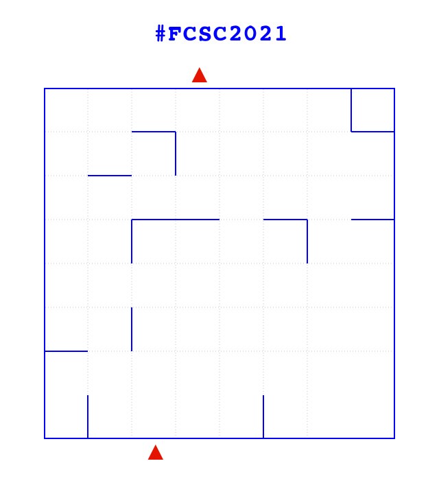
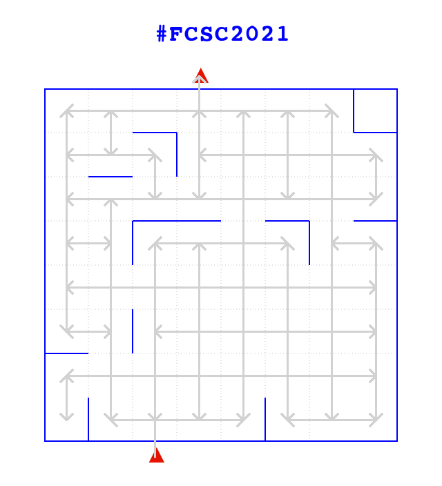
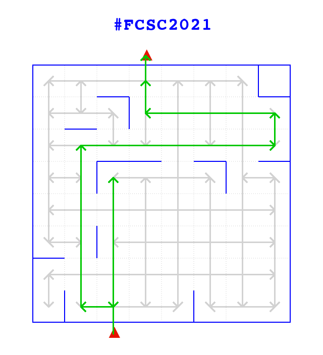

# Ventriglisse

> **Category:** Misc  
> **Points:** From 200 to 148 (dynamic scoring)

Connection to the challenge with netcat, we are given the following statement.

```
$ nc challenges1.france-cybersecurity-challenge.fr 7002
Hey there!
Welcome to our new attraction: the famous Ventriglisse!
A square area is filed with soap and some water and is very slippery!
Here is an example (base64-encoded image):
------------------------ BEGIN MAZE ------------------------
iVBORw0KGgoAAAANSUhEUgAAAoAAAALACAIAAACM91QYAAAlKUlEQVR4nO3d
e5CkZXk34HvY5aQg4gFYSmbBoNEIpUZA1KhRUyZixFiek1hgNKKSIlbiMfGA
... etc ...
ABIoYABIoIABIIECBoAEChgAEihgAEiggAEggQIGgAQKGAASKGAASKCAASCB
AgaABAoYABL8P4QUmTzsPkWVAAAAAElFTkSuQmCC
------------------------- END MAZE -------------------------
You are intially located outside the area at the bottom red mark.
At the beginning, you jump right in the area (head first!) and you slide up and stop at the first wall encountered.
Once you hit a wall, you can jump again in another direction to continue your amazing soapy journey.
Your goal is get out of the zone at the red mark at the top.
Send me how you would like to move within the maze as follows:
 - N to go North
 - S to go South
 - E to go East
 - O to go West
On the example above, a valid path would be NESENONOSENENON.
Note that a valid path would always start and end by 'N'.
In this example, paths starting by NO, NN or NEN would be invalid (as your head would hit a wall).
Press a key when you are ready...
```

## TLDR

1. Get the successive maze images with pwntools.
2. Represent each maze as a graph.
3. Find the shortest path from in the graph.
4. Transform the shortest path to cardinal directions and send the result back.

## Get the image with pwntools

```python
r = remote('challenges1.france-cybersecurity-challenge.fr', 7002, level='debug')
r.recvuntil('ready...')
r.sendline()

raw = r.recvuntil('END MAZE').decode()
raw_b64 = ''.join(raw.split('BEGIN MAZE')[1].splitlines()[1:-1])
img = Image.open(BytesIO(base64.b64decode(raw_b64)))
```



## Transform the image to a bidimensional array

Transform the image to a bidimensional array. We need to know, for each case, if there is a wall or not on each side and if the case is adjacent or not to a start or finish red arrow.

The following code goes through each case and detect adjacents walls by looking if there is blue pixels. It does the same thing to detect if the case is adjacent to a red arrow (start and finish arrows).

```python
class Case:
    def __init__(self, top, right, bottom, left, start, end):
        self.top = top
        self.right = right
        self.bottom = bottom
        self.left = left
        self.start = start
        self.end = end

    def __str__(self):
        return f'T: {self.top}  B: {self.bottom}\n' \
               f'L: {self.left}  R: {self.right}\n' \
               f'S: {self.start}  E: {self.end}'


max_x = (img.width // 64) - 1
max_y = (img.height // 64) - 1

# Parse maze
maze = []
for y in range(2, max_y):
    maze.append([])
    for x in range(1, max_x):
        case_x = x * CASE_SIZE
        case_y = y * CASE_SIZE
        # Find case walls
        wall_top = img.getpixel((case_x + 10, case_y)) == (0, 0, 255)
        wall_right = img.getpixel((case_x + CASE_SIZE - 1, case_y + 10)) == (0, 0, 255)
        wall_bottom = img.getpixel((case_x + 10, case_y + CASE_SIZE - 1)) == (0, 0, 255)
        wall_left = img.getpixel((case_x, case_y + 10)) == (0, 0, 255)
        # Is it a start or end case?
        start = img.getpixel((case_x + 30, case_y + CASE_SIZE + 25)) == (229, 20, 0)
        end = img.getpixel((case_x + 30, case_y - 15)) == (229, 20, 0)
        # Memorize the case
        case = Case(wall_top, wall_right, wall_bottom, wall_left, start, end)
        maze[y-2].append(case)
```

## Create a graph from the bidimensional array

Once we have our array, we can transform it to a graph.

To do that, we goes through each case of our array and try to slide from top to bottom, right to left, bottom to top and left to right. If it is possible to slide, we add an edge to the graph.

```python
graph = networkx.DiGraph()

# Transform the maze to a graph
for y in range(len(maze)):
    for x in range(len(maze[0])):
        case = maze[y][x]

        if case.top or case.right or case.bottom or case.left:
            # Top to bottom
            for slide_y in range(y, len(maze)):
                slide_case = maze[slide_y][x]
                if slide_case.bottom:
                    break
            if case != slide_case:
                graph.add_edge((x, y), (x, slide_y))
            # Right to left
            for slide_x in range(x, -1, -1):
                slide_case = maze[y][slide_x]
                if slide_case.left:
                    break
            if case != slide_case:
                graph.add_edge((x, y), (slide_x, y))
            # Bottom to top
            for slide_y in range(y, -1, -1):
                slide_case = maze[slide_y][x]
                if slide_case.top:
                    break
            if case != slide_case:
                graph.add_edge((x, y), (x, slide_y))
            if case.start:
                graph.add_edge('start', (x, slide_y))
            # Left to right
            for slide_x in range(x, len(maze[0])):
                slide_case = maze[y][slide_x]
                if slide_case.right:
                    break
            if case != slide_case:
                graph.add_edge((x, y), (slide_x, y))

        if case.end:
            graph.add_edge((x, y), 'end')
```



## Find a path

With the maze represented as a graph, it is easy to find a path from a point to another one using well known shortest path algorithms.

```python
# Find shortest path
path = networkx.shortest_path(graph, 'start', 'end')
```

`networkx.shortest_path` returns an array of nodes, we need to transform it to a string of cardinal directions.

```python
path_str = 'N'
for i in range(1, len(path) - 2):
    x1, y1 = path[i]
    x2, y2 = path[i+1]
    if y1 < y2:
        path_str += 'S'
    if y1 > y2:
        path_str += 'N'
    if x1 < x2:
        path_str += 'E'
    if x1 > x2:
        path_str += 'O'

if path_str[-1] != 'N':
    path_str += 'N'
```



## Complete script

In the [full script](solve.py), a loop is done to get successive images and the resulting path is sent back to the open socket using pwntools.

## Flag

> FCSC{c78b1d02700bbe83a8c4ec8cec7ce3109dfa1620189a460189a1e345447ae5f2}

## Thanks

Thanks to [Mathis Hammel write-up](https://blog.h25.io/FCSC-Mazopotamia/) on FCSC 2020 Mazopotamia challenge from which I was inspired to solve this challenge.
